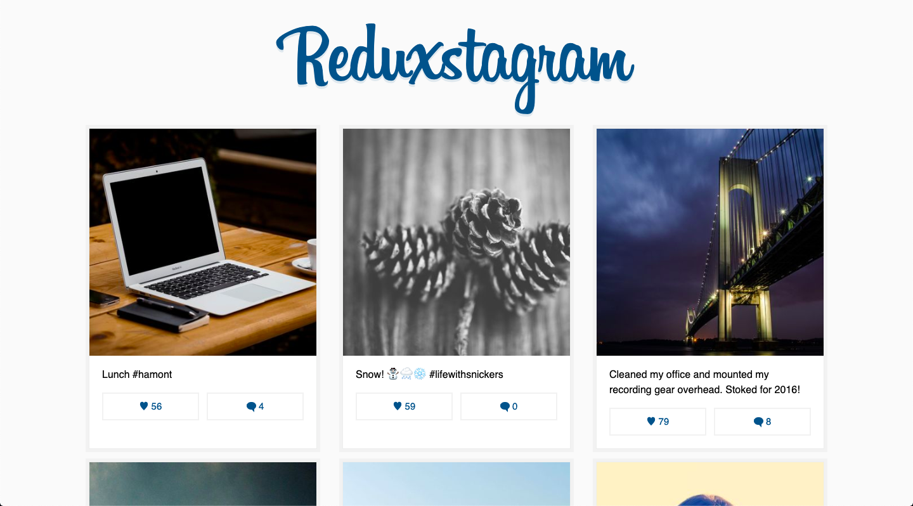

# Learn Redux

A simple React + Redux project build as a part of the course [Learn Redux](https://learnredux.com/) by Wes Bos.

## To start the development server

First `npm install` to grab all the necessary dependencies.

Then run `npm start` and open <localhost:7770> in your browser.

## Production Build

Run `npm build` to create a `dist` folder and a bundle.js file.

A live version of this project can be found here: [https://chirathr.github.io/reduxstagram/](https://chirathr.github.io/reduxstagram/)
